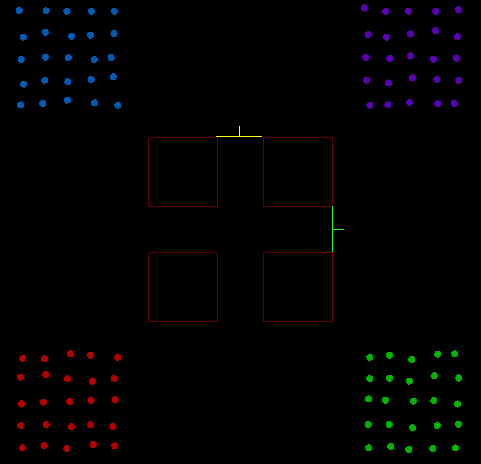

# Crowd Analysis

  
**The Crowd Analysis application**

The Crowd Analysis application is a pyQt-based application for performing post-hoc analysis and 
visualization on scb files. It supports the following types of analysis:
 
  - Density - compute a density field by convolving a density kernel with agent positions over a 
	discretized grid.
  - Flow - Count the number of agents that have crossed a marker line and estimate a smoothed 
    derivative of the rate of change (flow). It is *not* normalized for cross-sectional width.
  - Speed - draws dots on a discrete grid. The dots represent the center of each agent and the 
    color represents its speed.
  - Population - given a specified axis-aligned rectangle, determines the time-dependent population 
    of that box.
  - Fundamental diagram - given a specified axis-aligned rectangle, computes the fundamental diagram 
    by determining the average speed of agents passing through the box and the average density over 
	that interval.
 
The tool uses task-based paradigm for performing analysis. A single task can consist of any of the
above types of analysis. Given the type of analysis, the task contains analysis-dependent
parameters. The same type of analysis can be included in multiple tasks. This is useful to perform
the same type of analysis but with different sets of parameters.
 
The work of a task is broken into two phases: computation and visualization. The two phases can be
done together or separately. A common workflow is to perform the computation once and then iterate
several times on visualization (e.g., selecting a different color map for density).
 
The collection of all tasks can be saved in a configuration file and run from the command-line in
batch mode or by loading it in the GUI. Each task can be run singly, or all tasks can be run
*en masse*.

## GUI

The main application is shown in the figure above. There are four main regions:

  1. Task selection - this is where tasks will be added to the work flow.
  2. Task properties - after adding a task, the properties of the specific task will be edited in
     this region (Density analysis is shown in the figure).
  3. The 2D visualizer - this provides limited visualization capabilities. The definition of
     rectangular regions and flow lines will be done in this window. It can also display obstacles
     (as shown in the figure).
  4. Logger window - displays status of the application and provides data as to the progress of
     analysis.
   
## Menus

The app has limited menu options.
  - Input - this is an inactive placeholder. Nothing you do will cause this to activate.
  - Settings
    - Read Full Config - load a previously saved configuration file.
    - Save Full Config - save the current configuration to a file (for later execution).
  - Tasks
    - Copy Task Settings - initialize the values of the current task from another task in the 
	configuration.
	
## Workflow

The overall workflow consists of *adding* tasks to the configuration and *setting* the appropriate
parameters for each.

### Adding a task

  
**GUI for adding a new task**

The upper, left-hand corner of the app contains the configuration level tools: adding a task to the
configuration and executing the full configuration.  To add a task, do the following:
 
  1. Select from the pull down the desired analysis type: Density, Flow, Speed, Population, or
     Fundamental Diagram.
  2. Give the task a name.  (This name will distinguish between tasks that perform the same type of
     analysis and will be used as a directory name containing the cached files relevant to this
	 task.)
  3. Click the “Add” button. The task will appear below.
  
The last button (labeled #4 above), can be used for executing the analysis for *all* active tasks.

### Comon task parameters

  
**Common parameters for all task types**

The top of all task properties looks like the figure above. It has the following pieces of
functionality:
 
  1) The tab label indicates the *type* of task.
  2) The checkbox indicates if the task is active (checked) or not.  If unchecked, the task will
     not be executed when pressing the “Perform All Active Analysis Tasks”. The activity state is
	 preserved in the saved configuration file. Inactive tasks will also not be executed from the
	 command line.
  3) This is the name of the task. It was (optionally) set in field 2 in the "Adding a task" GUI.
     It can be changed by double clicking the current name (or on the line rule at the same height).
	 A dialog will appear where you can type a new name.  NOTE: If you perform the analysis and
	 *then* change the name, this task will become decoupled from the cached data. So, the analysis
	 computation would be duplicated.  See **File structure** (below) for more details.
  4) This button causes *this* task to be executed (ignoring all other tasks).
  5) This deletes this task from the configuration.
  6) This specifies what work the task does. The options are:
      1) Compute - perform the analysis, placing the *cached* computation results in the file system.
      2) Visualize - create the visualization of the computed data. If there is no cached computed
	     data, an error message will appear in the logger window.
      3) Compute & Vis. - perform the computation and visualization phase back to back.
  7) This is the scb file to be analyzed. To set this value, simply click on the field and a file
     dialog appears. Select the desired scb file and hit enter. The 2D visualizer will show the
	 initial state of the agents (as recored in the SCB).
  8) This is the time step. When loading an scb file, it will be set automatically and frozen. This
     should be considered purely informational.
  9) You can load an optional obstacle file into the tool to see the domain.  For some forms of
     analysis this is critical (e.g., flow, population, fundamental diagram). The obstacles will be
	 defined in the simulation specification file (scenarioS.xml). See **View manipulation** (below)
	 on how to change what is visible.
  10) Specify the root output directory into which all analysis files will be written.
  
Now we will look at the analysis-specific task parameters

### Density

  
**Selected frames from the density analysis on the 4square demo**

Density analysis consists of specifying the domain over which the density is computed, the size of
the cell that the region is discretized into, specifying the density kernel size, and specifying the
visualization color map and output file format.

  
**Parameters for density analysis**

  
**Visualization of density parameters**

Setting these parameters can be done through the viewer and/or the GUI as follows:
 
  1) The region is defined by specifying an axis-aligned box with its lower corner and its
     dimensions.  This is the box’s minimum x-value.
  2) This is the box’s minimum y-value.
  3) This is the box’s width.
  4) This is the box’s height.
  5) This is the cell size (in simulation units).  The smaller the cell, the higher resolution the
     output image is and the longer the analysis and visualization takes. Remember that pedestrians
	 have a radius of approximately 0.2 m. By setting this value to 0.1, a pedestrian would cover
	 approximately four cells in the grid. The *eye* icon to the right determines whether the cells
	 are drawn in the visualizer or not. The viewport figures above show the cell size visualized
	 on the left, and hidden on the right.
  6) Select the color map to apply to the scalar field. This color map will be applied to the
     density field at each simulation time step, but it will map to the range of values from [0,
	 max density], where max density was the highest density value computed across the entire
	 simulation. Crowd Analysis provides the following color maps:
      1) Black body
      1) Flame
      1) Grey scale
      1) Log black body
      1) Red blue
      1) Two-tone HSF
  7) This specifies the output image file format.  You can select one of: jpg, bmp, or png.
  8) The density is computed by convolving a truncated 2D gaussian with the agent positions. This
     value represents the width of one standard deviation of that kernel. Larger values will
	 increase the influence of a single agent to the density field over a larger area, but at the
	 cost of diffusing the maximum effect. The *eye* icon to the right determines if the kernel size
	 is illustrated in the visualizer (the yellow curve above the green grid). The viewport figures
	 above show the kernel visualized on the left, and hidden on the right.

The domain can be determined numerically through the above gui, or directly in the visualizer window.
Hovering the mouse over any of the green domain boundaries will cause the edge to become highlighted.
At that point, you can click and drag the boundary to change the size of the domain (the values in
the GUI will change to reflect this). 

This task is facilitated by loading either the SCB and defining the domain over the range of motion,
and/or by loading the scene's obstacles and defining the domain relative to the obstacles.

### Flow

  
**Resultant plot for performing flow analysis on the 4square demo**

Flow analysis is all about defining flow lines. The analysis counts the number of agents that cross
the flow line (in a single direction). It can be used to count flow in a corridor or egress from a
room.

  
**Parameters for flow analysis**

  
**Visualization of flow parameters**

The figure above shows the 4square example with two flow lines. Each of the lines spans the interval
through which agents must pass to enter the area between the squares. Each line has a perpendicular
tick indicating the direction pedestrians must pass to be counted. In this case, only the flow into
the region is counted.
 
Typically, to create meaningful flow lines, the obstacles for the corresponding scb file should be
loaded so the flow lines can be placed in the appropriate location. Flow lines can be created and
edited using both the GUI and in the viewer:
 
  1) This selects which flow line is currently active. If there are no flow lines, this combo box is
     empty an inactive. Otherwise, it will be show the names of all existing flow lines.
  2) The “Add” button will add a new *default* flow line to the set. This flow line will have a 
     default name, and zero length -- as such, it will not be visible in the visualizer. After
	 clicking "Add", the "Edit in View" button becomes active. You can edit the name and the extent
	 of the default flow line.
  3) This causes the currently selected flow line to be deleted.
  4) If the “Edit” button is highlighted, dragging in the obstacle view will change the active line
     segment. The only way to "edit" the line is to draw a new line by clicking and dragging. The
	 flow line's end points will be at the location of the mouse press and mouse release,
	 respectively.
  5) This causes the flow direction of the line to reverse itself. Remember, the flow analysis only
     counts agents that move across the flow line in the indicated direction. Make sure the tick
	 mark is pointing in the correct direction.
  6) This displays the flow line's name and allows editing the name. In the scenario shown above,
     the flow lines are named north and east. These names will be included in the graph showing flow.
	 Flow across each line will be labeled with the line name.
  7) Shows and allows editing of the current flow line's, starting point's x-value. 
  7) Shows and allows editing of the current flow line's, starting point's y-value.
  7) Shows and allows editing of the current flow line's, ending point's x-value.
  7) Shows and allows editing of the current flow line's, ending point's y-value.
  
### Speed

> TODO: Write this up.

### Population

> TODO: Write this up.

### Fundamental Diagram

> TODO: Write this up.

## File structure

In the "Common task parameters" section above, number `10` requires you to specify a "root" folder
for the analysis. Assume we have the following tasks:
  - Density task called "density1" which does "computation and visualization".
  - Density task called "density2" which does only "computation".
  - Flow task called "flow1" which does "computation and visualization".

Given a root director (`ROOT_DIR`), if we execute all of these tasks, we'll get the following 
directory structure:

  - `ROOT_DIR`
    - `density`
	  - `density1`
	    - `cached data`
		- `visualized data`
	  - `density2`
	    - `cached data`
	- `flow`
	  - `flow1`
	    - `cached data`
		- `visualized data`

Each type of task is stored in its own directory (whose name is derived from the task type). That's
why we there are *two* directories in `ROOT_DIR`, `density` and `flow`. Inside each task *type*
folder, each active task will have a folder with the same name as the task (it's important to make
sure each task has a unique name). In this case, the `density` folder contains two sub-folders:
`density1` and `density2`. These named-task folders contain the result of analysis. For tasks that
do only computation (like `density2`) it will only contain cached analytical data. For tasks that 
do computation *and* visualization, it will contain both. Tasks that are configured to do *only*
visualization must already have cached data in that directory to be able to do its work.

## View manipulation

As indicated above, various tasks allow interacting with the visualizer view to set parameter
values. This section discusses the properties of the view that apply to every task. There are a 
number limited number of operations that can be performed in the visualizer:

  - "Zooming" the view. This has the effect of moving the camera closer and farther. Use the mouse
     wheel to zoom in and out.
  - "Panning" the view. This has the effect of moving the camera left/right/up/down. Hold the `Ctrl`
     button down and left drag with the mouse. The scene will move with the mouse pointer.
  - "Scrubbing" the playback. When an scb file is loaded, the play button and timeline bar below
     the viewer will become active. You can hit the playback to see the scb file playback in 
	 realtime or simply grab the time indicator and drag it left and right to see different times in
	 the simulation.
  - Auto-zoom. When obstacles or SCB files are loaded, the view will move to tightly frame the
    loaded data.
