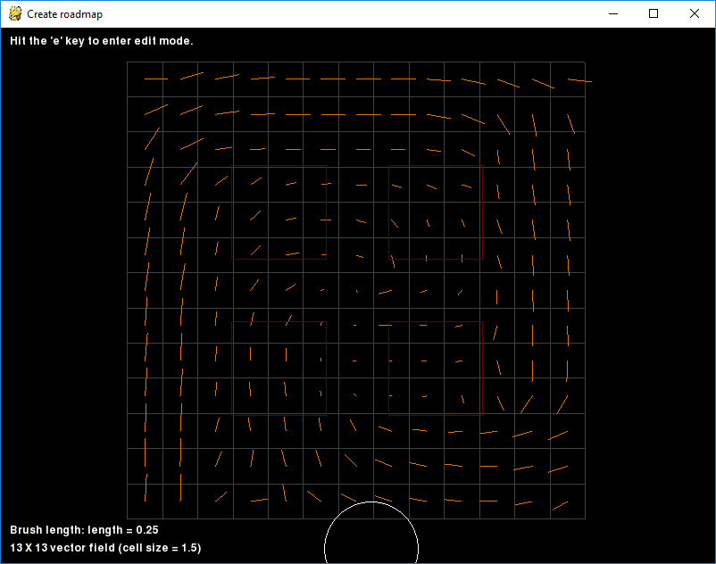

# Roadmap Builder

Roadmap builder is an anachronistic name. It was born as a quick and dirty solution to the need to
author roadmaps (i.e., 2D graphs). It has long since grown beyond those initial roots to include
the ability to:

  - create roadmap graphs given a set of obstacles
  - define Menge goals (both goal sets and the individual goals in each set)
  - create obstacles from scratch
  - define explicit agent positions
  - generate a navigation _field_
  - playback scb files
  - create images from the contents (both raster and vector graphic -- the latter relies on pycairo)
  - query the world-space position of points in the simulation domain

In addition to *creating* content, existing content can be parsed into the roadmap builder for
introspection. For example, an existing obstacle definition can be read in and an explicit set of
agents can be added around the obstacles.

The various options can all be mixed and matched (i.e., in a single session, one can create
obstacles, pre-populate the world with agents, create a navigation field, and define goals). We will
discuss each task one by one.

## Roadmap builder dependencies

In addition to the dependencies that the utilities generally have, `roadmapBuilder.py` has an
additional _optional_ dependency: pycairo. If it is present, it can output a vector graphic version
of what the application's viewport is currently displaying.

## Working with Roadmap builder

### Running the application

Running the application is as simple as:

```
python roadmapBuilder.py
```

The application uses `optparse` so help on the possible command-line arguments can be retrieved as:

```
python roadmapBuilder.py --help
```

Which produces the following result:

```
Usage: roadmapBuilder.py [options]

Options:
  -h, --help            show this help message and exit
  -r ROADMAPNAME, --roadmap=ROADMAPNAME
                        Optional roadmap file to load
  -g GOALSNAME, --goals=GOALSNAME
                        Optional goal definition file to load
  -b OBSTNAME, --obstacle=OBSTNAME
                        Optional obstacle file to load.
  -a AGTNAME, --agent=AGTNAME
                        Optional agent position file to load.
  -f FIELDNAME, --field=FIELDNAME
                        Optional vector field file to load.
  -c, --createField     Creates a field based on the domain of the obstacles -
                        ignored if --field(-f) is specified
  -s SCBNAME, --scb=SCBNAME
                        Optional scb file to load.
  -i INDIR, --inDir=INDIR
                        Optional directory to find input files - only applied
                        to file names with relative paths
  -o OUTDIR, --outDir=OUTDIR
                        Optional directory to write output files - only
                        applied to file names with relative paths
  --region=BOUNDREGION  Specify the bounding region of the action.  If
                        provided, it will set the initial camera properties.
                        Format is minX minY maxX maxY
```

#### Command-line parameters

  - `--region` When the application launches, the camera has to be positioned to look at *some*
    region. If obstacle defniitions are provided, then the camera is positioned to frame the 2D
    bounding box of the obstacles. If you have no obstacles to load, it is advisable define the
    bounding box of the region you want to simulate so that all other operations are in a
    meaningful domain.
  - `--outDir`, `-o` When *creating* some aspect of the simulation properties, the application 
    will generate files with *fixed* names. Those files will be written into the output directory.
    If no directory is defined, it will be the current working directory.
  - `--inDir`, `-i` While each input file (see options below) can be fully specified w.r.t. an
    absolute or relative path to the execution directory, typically, for a single simulation 
    scenario, all of the files are in a common directory. It can be convenience to specify that
    directory with *this* parameter and then simply name the input files by file name (without
    path).
  - `--createField`, `-c` If you have no navigation field to load, but want to create one, this
    flag will prepare the application for doing so. See [Creating a navigation field].
  - `--field`, `-f` If you want to create a navigation field by editing an existing field or 
    simply visualize the existing field, you can specify the name of the file containing the
    navigation field with this parameter. It works in conjunction with the `--inDir` parameter. See
    [Creating a navigation field].
  - `--scb`, `-s` Simulation results can be visualized (and output as images) assuming they've 
    been written to an `.scb` file. This parameter specifies the file to load and works in
    conjunction with the `--inDir` parameter. See [Playback SCB files].
  - `--agent`, `-a` Loads the set of explicitly declared agents in a scenario file. This does not
    work with parameterically generated agents (e.g., lattice-generated agents). Works in
    conjunciton with the `--inDir` parameter. See  [Creating agents].
  - `--obstacle`, `-b` Loads the set of obstacles defined in a scenario file. Only applies to the
    `explicit` obstacle set. Works in conjunciton with the `--inDir` parameter. See
    [Creating obstacles].
  - `--goals`, `-g` Loads the set of goals defined in a bheavior file. Works in conjunction with
    the `--inDir` parameter. See [Creating goals].
  - `--roadmap`, `-r` Loads the roadmap defined in the given file. Works in conjunction with the
    `--inDir` parameter. See [Creating a roadmap].

### Contexts and interactive help

The application generally works through the concepts of a "tool context". The keyboard and mouse
actions are interpreted by the current *context*. For example, in the agent context, clicking the
left mouse button might create an agent. But in the goal context, it would create a new goal.
All functionality is governed by selecting the context you want to work in and then hitting the
right sequence of keyboard and mouse buttons to achieve the desired effect.

Each context has a primitive form of getting interactive help. Simply hit the `h` key and the
display will print out text explaining the actions you can take. The text displayed depending on
what context you are in.

Note: Currently, there is one exception to the context paradigm: roadmap creation/editing. It has
not been brought up to date and suffers from some unique idiosyncracies as documented below.

When you first enter the program, the active context is the "context selector". Viewport
manipulation is available to you as well as the ability to select other contexts. You can always
return to the selector context from a task context by hitting the `esc` key.

### Moving the camera

The application presents a simple 2D view of the world. As such, there are only two camera
operations:

 - pan: moving the camera around a plane parallel to the simulation plane
 - zoom: changing the domain visible in the viewport. Zoom actions always zoom around the position
   of the mouse when the action is taken.

## Query the world space position of a point

The simplest context is the `PositionContext`. It simply reports the simulation world space 
position of the mouse.

From the context selector, hit the `q` key. And then simply move the mouse.

NOTE: There is a known issue that simply *entering* the context will not display the mouse position
(or possibly not display the *correct* mouse position). Move the mouse to refresh the location
display.

## Creating a roadmap

Creating and editing a roadmap is the exception to the context paradigm. It was the original and
hasn't been updated yet. Because the roadmap functionality is not in a context (see issue
https://github.com/curds01/MengeUtils/issues/8), it does *not* display task-specific guidance when
hitting the `h` key.

To begin editing/creating a roadmap, hit the `e` key from the context selector (or, in fact, any
context that hasn't mapped the `e` key to some other operation). The text in the upper-left
corner of the display will read `Edit roadmap`. When graph editing is disabled, the text reads
`Hit the 'e' key to enter edit mode`.

The graph is displayed with green edges connecting yellow vertices. When graph editing is disabled,
the graph colors will be darkened.

 <br>
**Figure 1: A simple graph displayed ready for editing**

### Creation vs Editing

When the mouse moves, as it nears a vertex, the glyph representing the vertex will grow larger. This
indicates that it is the *active* vertex. Similarly, if the `Shift` key is down, as the mouse moves
near an edge, that edge gets thicker; this indicates it is the active edge. The behavior of the keys
and mouse depends on whether there is an active element or not. The behavior is outlined below.

- Active vertex
  - mouse
    - `left-mouse click and drag`: Move the active vertex
    - `middle-mouse click and drag`: Create an edge by connecting the active vertex to another 
      vertex. As the mosue nears another vertex, an active edge will be drawn.
  - keyboard
    - `delete`: removes the active vertex and all edges connected to it.
- Active edge
  - mouse (nothing)
  - keyboard
    - `delete`: removes the active edge, leaving the vertices in place.
- No active element
  - mouse
    - `left-mouse click`: Create vertex at mouse position.
    - `left-mouse click and drag`: Create vertex at mouse position and begin moving it.
    - `middle-mouse click and drag`: Create a new vertex and create an edge between the new
      vertex and some other vertex. (Note: right-click cancels the *edge*, but leaves the newly
      created vertex. This is functionally treated as *two* operations and only the last is
      canceled.)
  - keyboard (nothing)
- General operations
  - mouse
    - `right-mouse click`: If performing some action (vertex movement, edge creation), cancels the
      operation and restores the graph to its original state. Otherwise, the click does nothing.
  - keyboard
    - `Ctrl-s`: Saves the graph into the file `graph.txt` in the output directory.

## Creating goals

<br>
**Figure 2: An example of editing goals; two goal sets, with an oriented box currently being edited.**

The goal context allows for defining goals. To enter the goal context, hit the `g` key from the
context selector.

Goals are represented with simple geometric shapes: points, circles, axis-aligned boxes, and
oriented boxes. Each goal is a member of one and only one goal set. Defining a simulation scenario's
goals comes down to creating goal sets and populating them with goals -- for each goal, define the
space that the goal encompasses.

All goal sets (and their member goals) can be written to the file `goals.xml` in the output
directory.

Because the context has interactive help, this documentation won't define the exact keyboard
shortcuts or mouse actions required, but will simply enumerate the kinds of things that can be done.
Please refer to the interactive help for *how* they are accomplished.

### Goal sets

There is always at least one default goal set (its id is -1). New goal sets can be added. Goal sets
can be deleted (and all of their member goals deleted as well). You can iterate through the goal
sets (where one is always considered to be the "active" goal set).

### Goals

Given an active goal set with member goals, simply moving the mouse around will cause a goal to be
highlighted. The highlighted goal becomes the target of editing operations. Editing operations
include deleting the specific goal, moving it, and changing its geoemtry (e.g., circle radius).

Editing goals typically requires several actions (with the `point` goal type being an exception;
see below). When a goal is highlighted (based on mouse movement), the goal has to be activated for
editing by left clicking it. At that point, various artifacts will become active on the geometry.
When done editing, left-click again in empty space to stop editing that particular goal.

These are the artifacts for editing each goal type.

- `point`: Only the position can be edited. Simply drag on the point.
- `circle`: The radius is modified by dragging on the circle's circumference. Dragging on the
  interior of the sphere will move it.
- `axis-aligned box`: Drag on the interior to move the box. Small points appear on the
  minimum and maximum corners. Dragging either of these points will resize the box.
- `oriented box`: Drag on the interior to move the box. Red and blue points will appear on two
  corners. Dragging on the red point will resize the box. Dragging on the blue point will rotate the
  box around its minimum point. The concept of "minimum" point can get confusing with oriented
  bounding boxes. Simply said, it's the point opposite the blue dot.

## Creating obstacles

<br>
**Figure 3: The obstacles from the 4square example prepared for editing.**

The obstacle context allows for the definition of explicit goals (not goals implicitly defined by
a navigation mesh). To enter the obstacle context, hit the `o` key from the context selector.
Because the context has interactive help, this documentation won't define the exact keyboard
shortcuts or mouse actions required, but will simply enumerate the kinds of things that can be done.
Please refer to the interactive help for *how* they are accomplished.

All obstacles are closed polygons. The obstacle context provides simple tools for creating and 
editing closed polygons. In Menge, the ordering of the polygon vertices makes a difference. It
defines an "inside" and "outside". Agents can freely move from inside to outside but not from
outside to inside. The obstacle context provides two mechanisms: polygon color and normal display.
Agents can't pass into *red* obstacles, and can't move out of *blue* obstacles. Similarly, when
normals are displayed, the normals point to the *outside* of the walls.

The obstacles defined in the application can be written out to the file `obstacles.xml` in the
output directory in XML format that is sufficient to copy and paste into a Menge scenario file.

The context has two modes: creation and editing.

### Obstacle creation

Obstacle creation consists of creating a sequence of vertices to form a closed polygon. During the
creation process, a limited amount of editing is possible (the obstacle being constructed can be
deleted, the last vertex added can be removed, and the ordering of the vertices (which defines the
"outside" and "inside" of the polygon) can be reversed.

Any other changes which need to be made can simply be done in the edit mode.

### Obstacle editing

In the edit mode, elements of the obstacle (vertices or edges) can be moved or removed. Vertices can
be removed, or inserted into a selected edge. Whole polygons can be removed with all elements.

## Creating agents

<br>
**Figure 4: A number of agents added to the 4square example's obstacles.**

The agent context allows for the addition and removal of agents. The agent radius can likewise be
defined. Currently, no other agent properties can be configured. The agents defined in the
application can be written to the `agents.xml` file in the output directory.

## Creating a navigation field

<br>
**Figure 5: A default created navigation field applied to the 4squre obstacles.**

### What is a navigation field

Given a *particular* goal, we can define a *distance function* on the domain -- it is the minimum
distance from any point in the domain to that goal. The shortest path is taken by following the
*gradient* of that funciton (i.e., the direction where the distance to the goal gets smaller the
fastest). A Menge navigation field is a regular sampling of that function. We create a regular grid
and sample the gradient of the distance field at each point in the grid. There are several
implications:

  - For each unique goal, you need a unique navigation field.
  - For simple domain, it is enough to make a coarse grid, but for complex domains, it may be
    necessary to create a higher-resolution grid.
  - Evaluating grids is generally cheap, higher resolution grids simply consume more memory.
  - Where obstacles complete contain a cell in the regaular grid, the navigation mesh *could* report
    a zero velocity -- after all, there is no path through a solid object. But for Menge, it tends
    to be more reliable if it simply points out of the obstacle (Menge cannot guarantee that agents
    will not penetrate obstacles to some degree).

Generally, there are algorithms by which minimum distance and its gradient can be computed on the
navigation mesh. These algorithms have not yet been implemented in Menge. Therefore, this
application provides some tools to create an approximate navigation field by hand.

### Naviation field tools

Navigation fields must be created in a finite domain -- specifically, a rectangular domain. The
application can create a new vector field (with its domain intialized to the bounding region of
the scenario), or a previously saved field can be loaded. Creating a new field is done by passing
the `--createField` (`-c`) command-line parameter. A saved field file can be loaded with the
`--field` (`-f`) command-line parameter.

When a field has been created or loaded, the application will display the domain of the navigation
field (a grey rectangular grid). You can enter the mode to edit the field by hitting `f` key from
the context selector. The field editing context, in turn has modes for the following tasks:

  -  Changing the domain size. See [Sizing the navigation domain]
  -  Painting the directions of the navigation field vectors. See [Field directions]
  -  Painting the magnitude of the navigation field vectors. See [Field magnitudes]
  -  Smoothing the navigation field. See [Smoothing the field]

#### Sizing the navigation domain

<br>
**Figure 6: The navigation mesh in the domain-editing mode.**

Enter the domain editing mode by hitting the `4` key in the field editing context. The
boundary of the grid will be highlighted in green. The domain can be modified simply be hovering
over one of the green edges (it should become highlighted) and then dragging on it to change the
domain.

This mode also allows for the definition of the cell size. For a given cell size, as the
boundaries move, whole cells will be added row-by-row or column-by-column for the given cell size.
To change cell sizes, hit the right and left arrow keys. By default, each press of an arrow key
will change the cell dimension by 1 unit. By holding down one modifier key (ctrl, alt, or shift),
the cell size will change by 0.1 unit. Holding *two* modifier keys will change the cell size by
0.01 units and three modifier keys set the change to 0.001 units.

__Editing the field domain in any way (extent, position, or cell size) will cause all vector values
that may have previously been edited to be reset.__

#### Field directions

<br>
**Figure 7: The navigation mesh in the vector *direction* mode; the directions have been painted to
create an inward spiral.**

Enter the direction-editing mode by hitting the `1` key. A line will be drawn from the center
of each cell into the field's direction for that cell. The mouse cursor becomes a white circle and
the screen displays the words `Brush direction` in the bottom-left corner of the view.

The mouse serves as a circular brush for painting the vectors. The brush has a Gaussian-like effect.
It is strongest at the center of the circle and falls off to zero effect at the boundary. The brush
can be made larger and smaller by pressing the `up` and `down` arrow keys, respectively.

The direction is defined by dragging the brush across the field -- like a brush. The instantaneous
displacement of the brush (based on the path along which it is dragged) is computed and that
quantity is applied to the field within the reach of the cursor.

#### Field magnitudes

<br>
**Figure 8: The navigation mesh in the vector *magnitude* mode; the spiral vector field has been given
decreasing magnitudes as it converges to the center.**

Enter the magnitude-editing mode by hitting the `2` key. The display resembles that of
direction editing. The brush works the same way; resize with `up` and `down` arrows with a Gaussian
region of effect.

In this case, the magnitude of the vectors are painted by dragging the brush. The current paint
value is displayed in the bottom-left corner and can be changed by increments of 0.05 units by
hitting the `left` and `right` arrow keys.

#### Smoothing the field

<br>
**Figure 9: The navigation mesh in the smoothing mode.**

Enter the field-smoothing modet by hitting the `3` key. The text `Brush smooth` will appear in
the bottom-left corner and the cursor will change two be two concentric circles (a white and blue
circle).

Like the other field editing, it works by defining a region of influence (the white circle) and
applying an operation to the field in the area covered by the white circle with a Gaussian set of
weights. The brush size (white circle) is changed with the `up` and `down` arrow keys.

The smoothing operation uses gaussian smoothing on the vector field. The size of the area considered
is based on the kernel size (made larger and smaller with the `[` and `]` keys, respectively).
Larger kernels have the effect of a larger "blur" operation. The smoothed field is combined with the
existing field via the smoothing strength (made weaker and stronger with the `left` and `right`
arrows, respectively). A small strength will modify the field gradually. A large strength will
modify the field at a higher rate.

The "smoothing" simply linearly combines vector values. That means opposing vectors get gradually
averaged to the zero vector; there is no spherical linear interpolation. Also, because of the
nature of Gaussian smoothing, when applying smoothing near the boundary of the field, it must draw
data from outside the domain of the field. In this case, it is provided with zero values. This has
the effect of gradually smoothing the boundary vectors to zero. One way around this is to make the
vector field larger than the region you care about.

## Playback SCB files

<br>
**Figure 10: Playing back cached trajectories (scb files).**

The application can load the saved trajectories from a simulation (scb files). When such a file is
loaded the `SCB context` is made available (hit the `s` key from the context selector). When the
`SCB context` is active, the text `Play SCB` appears in the bottom-left corner of the viewport
and colored agents will be displayed in the viewport as well. The agents are colored according to
their saved class ids (note: not all SCB file format versions save class information).

The `SCB context` can:

  - Change how agents are displayed. See [Agent display].
  - Output instantaneous agent configuration. See [Output agent configuration].
  - Scrub through time. See [Scrub through time].
  - Save images from the viewport. See [Save images].

### Agent display

By default, the agents are colored by their class id. They can also be colored based on which state
they are in (assuming the SCB file format used provides that data). This display is toggled by
pressing the `c` key.

### Output agent configuration

As you [scrub through time], you can save out an xml file that gives the positions of all agents
at that moment in time. To do so, hit `ctrl-s`. It will be saved to the file `scene.xml` in the
configured output directory.

### Scrub through time

The text in the bottom-left corner displays the current frame being displayed from the SCB file.
It does *not* display the simulation time, because it doesn't know the simulation step size. It is
up to you to know that information and use it translate frame number to time.

You can do the following to change the displayed frame:

  - Go to the first frame (`up arrow`).
  - Advance to the next frame (`right arrow`).
  - Back up to the previous frame (`left arrow`).
  - Advance or back up at a higher rate by holding down one or more modifier keys (`ctrl`, `alt`,
    and `shift`). The more keys you hold, the more frames are jumped with each press of the
   `right` and `left` arrow keys.

### Save images

The viewport can be saved to two types of images with two types of techniques.

  - The application can automatically save a `.png` of every frame you display by toggling the
    output state (`ctrl-o`). When output is enabled, the text `saving display` will appear in the
    text at the bottom-left of the screen. The images are saved to the configured output directory
    with the name scb#####.png, where the number is a zero-padded representation of the *frame*
    number.
  - If you have pycairo installed, it can also output a vector-graphic version of what is displayed
    in the viewport (`ctrl-p`). Only obstacles and agents are drawn. The resulting file is written
    to the configured output directory and is named `scb#####.svg`, where the number is a
    zero-padded representation of the *frame* number.
